# Hey, I'm Masoud 👋

### Full-Stack JavaScript Developer · Vue.js · Nuxt · Node.js

I’m a developer focused on building modern, responsive and
scalable web applications with clean architecture and polished UI.

I enjoy turning ideas and designs into real-world products —
from frontend interfaces to backend APIs and database architecture.

---

## ⚡ Tech Stack

### Frontend

### Backend

### Tools & Design

---

## 🚀 What I Build

- 🌐 Modern web applications with Vue & Nuxt
- ⚙️ REST APIs with Node.js & Express
- 🗄️ MongoDB-based applications
- 🎨 Responsive UI & design systems
- 🔐 Authentication & permission systems
- 📊 Dashboards and management platforms
- 🚀 Production-ready web applications

---

## 📌 Featured Projects

### 🌦️ Weather App

A modern weather dashboard built with Nuxt, TypeScript and weather APIs.

**Nuxt · Vue · TypeScript · REST API**

---

### 📋 TaskFlow

A modern project and task management platform inspired by tools like
Trello and Jira.

**Vue · Nuxt · Node.js · Express · MongoDB**

---

## 📊 GitHub Stats

---

## 🏆 GitHub Trophies

---

## 🐍 Contribution Graph

---

## 🌐 Connect

---

### 💡 Always learning. Always building.

